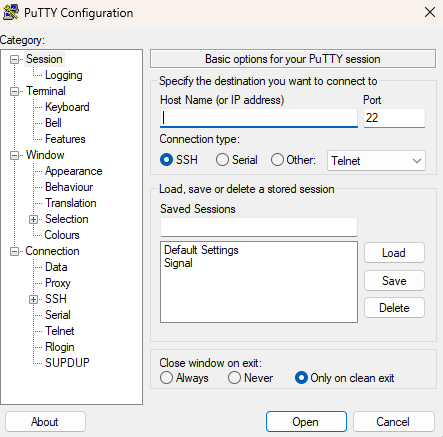
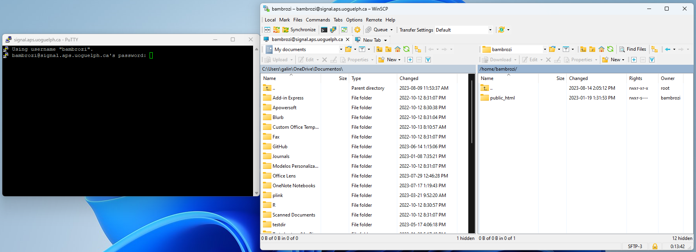
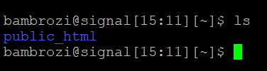
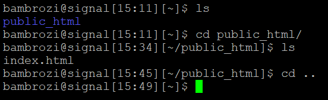
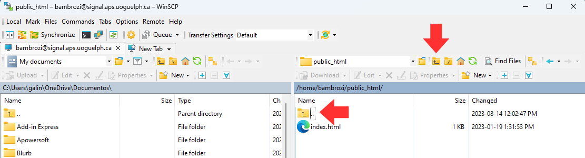

# Operational system

To have access to the server the first application you will need is one "terminal". From here there is a difference between Windows and Ios. If you are using IOS you already have one terminal in your computer, but if you are using Windows you need to download and install one *terminal emulator*. One of the options is:

 - <a href=https://www.chiark.greenend.org.uk/~sgtatham/putty/latest.html>PuTTY</a>
  
  
  
  
Now you have one terminal in your machine, the second stuff you may want to have is one application to make "friendlier" your file management, some applications makes this action look like a Windows interface and not a command line.

 - <a href=https://winscp.net/eng/download.php>WinSCP</a>:  It is a free and open-source graphical SFTP (Secure File Transfer Protocol), FTP (File Transfer Protocol), and SCP (Secure Copy Protocol) client for Windows. WinSCP allows users to securely transfer files between a local Windows computer and a remote server using encrypted protocols.
  
  
  

# Getting access to the terminal

1. Contact IT support:
  First step is contact the Animal Bioscience's IT support using the e-mail abscit@uoguelph.ca<abscit@uoguelph.ca> asking for access the CGIL server. They will provide you one password and any additional directions. Your user will be the first part of your institutional e-mail (e.g. for the e-mail userxyz@uoguelph.ca the user will be *userxyz*).

2. Starting PuTTY:

 - In the field *Host name (or IP address)* type your <span style="background-color: yellow;">user name</span> the character <b>@</b> and the server address <span style="background-color: lightskyblue;">signal.aps.uoguelph.ca</span>

 - hit the button *open* pointed with the red arrow.


3. Starting WinSCP:

 - In the field *Host name* again you should type the server address <span style="background-color: yellow;">signal.aps.uoguelph.ca</span>, in the *user name* field type your <span style = "background-color: lightgreen;"> user name </span> and in the *Password* field type your the <span style = "background-color: lightskyblue;">Password</span>.
 - Finally hit the *login* button pointed with the red arrow.
  


4. Basic commands

Now you have two ways to access the server from your computer:



 - On the left side you have the server in **command line** using PuTTY.
 - On the right side you have the server in the **WinSCP version**. 
 - You will need to use the command line version to type the commands when running software, but for managing your files, you can opt for the WinSCP version, which allows you to drag, copy, and paste in an easier way.

Now we will show some commands for the command line and the equivalent to WinSCP:

<span style="font-weight:bold;">(a)</span> The <span style="color: blue;">ls command </span> will show you the files and directories into your current directory
```{bash eval=FALSE}
ls
```




As you can see in the immage above the command *ls* was typed after the signal <b>$</b>, before this signal you have your user name, so any command shoulbe be typed after this signal.

After type *ls* and hit the "enter" button in your keyboard, the terminal will show you the content of that directory, in this example just the directory *public_html*.

<span style="font-weight:bold;">(b)</span> The <span style="color: blue;">cd command </span> stands for *change directory* and will enable you go to another directory
```{bash eval=FALSE}
cd public_html 
```


This command is equivalent to hit any directory on WinSCP.

Note that now after the user name we can see the current directory, in this case *public_html*. If we type again *ls* we will see the content of *public_html* directory.


We can observe that the file *index.html* is the content of this directory. Note that directories as *public_html* are shown in <span style=color:blue;">blue</span> and files as *index.html* are show in white.

<span style="font-weight:bold;">(c)</span> The <span style="color: blue;">cd .. command </span> will bring you back to the parent directory
```{bash eval=FALSE}
cd ..
```



So as you can see in the image above, the command *cd ..* took you back to the same directory you was before you use the *cd public_html* command. The red arrows in the image below show the equivalent buttons to this command line in the WinSCP version.





