Server Access
================
BrunoGalindo
2023-08-14

# Operational system

To have access to the server the first application you will need is one
“terminal”. From here there is a difference between Windows and Ios. If
you are using IOS you already have one terminal in your computer, but if
you are using Windows you need to download and install one *terminal
emulator*. One of the options is:

- <a href=https://www.chiark.greenend.org.uk/~sgtatham/putty/latest.html>PuTTY</a>

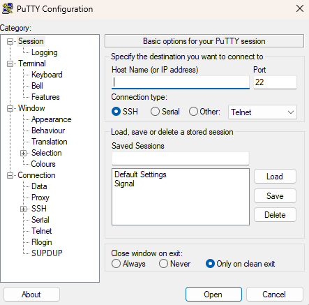

Now you have one terminal in your machine, the second stuff you may want
to have is one application to make “friendlier” your file management,
some applications makes this action look like a Windows interface and
not a command line.

- <a href=https://winscp.net/eng/download.php>WinSCP</a>: It is a free
  and open-source graphical SFTP (Secure File Transfer Protocol), FTP
  (File Transfer Protocol), and SCP (Secure Copy Protocol) client for
  Windows. WinSCP allows users to securely transfer files between a
  local Windows computer and a remote server using encrypted protocols.

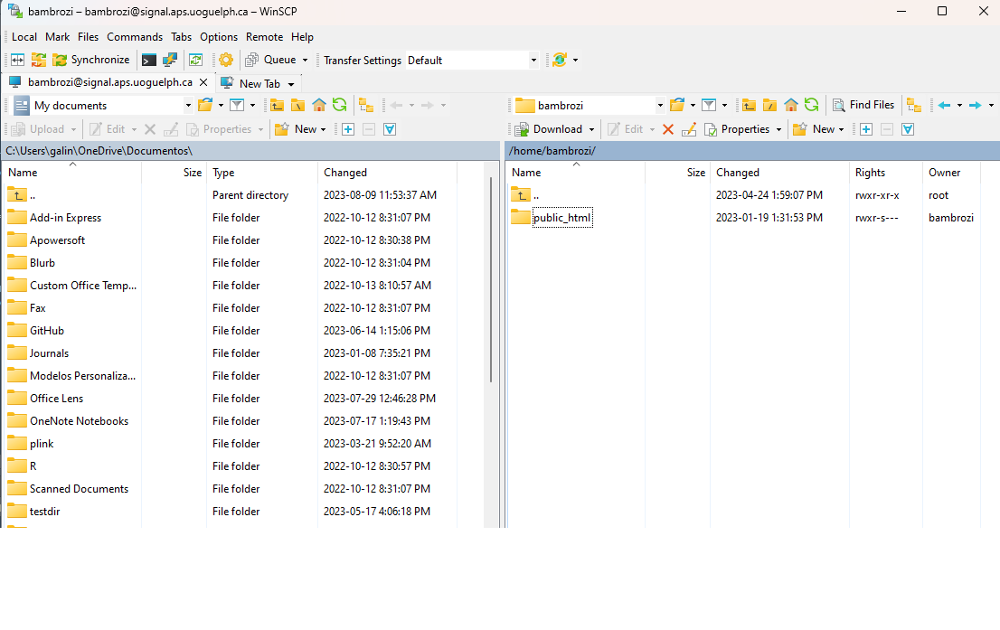

# Getting access to the terminal

1.  Contact IT support: First step is contact the Animal Bioscience’s IT
    support using the e-mail <abscit@uoguelph.ca><abscit@uoguelph.ca>
    asking for access the CGIL server. They will provide you one
    password and any additional directions. Your user will be the first
    part of your institutional e-mail (e.g. for the e-mail
    <userxyz@uoguelph.ca> the user will be *userxyz*).

2.  Starting PuTTY:

- In the field *Host name (or IP address)* type your
  <span style="background-color: yellow;">user name</span> the character
  <b>@</b> and the server address
  <span style="background-color: lightskyblue;">signal.aps.uoguelph.ca</span>

- hit the button *open* pointed with the red arrow.

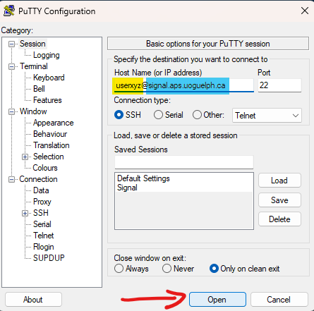

3.  Starting WinSCP:

- In the field *Host name* again you should type the server address
  <span style="background-color: yellow;">signal.aps.uoguelph.ca</span>,
  in the *user name* field type your
  <span style="background-color: lightgreen;"> user name </span> and in
  the *Password* field type your the
  <span style="background-color: lightskyblue;">Password</span>.
- Finally hit the *login* button pointed with the red arrow.

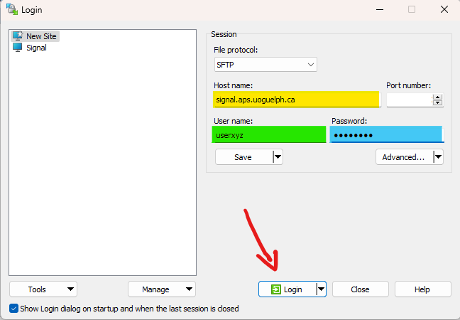

# Basic commands

Now you have two ways to access the server from your computer:

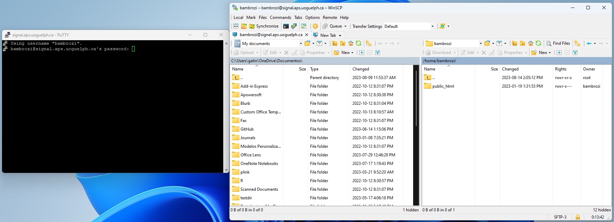

- On the left side you have the server in **command line** using PuTTY.
- On the right side you have the server in the **WinSCP version**.
- You will need to use the command line version to type the commands
  when running software, but for managing your files, you can opt for
  the WinSCP version, which allows you to drag, copy, and paste in an
  easier way.

## Now we will show some commands for the command line and the equivalent to WinSCP:

<span style="font-weight:bold;">(a)</span> The
<span style="color: blue;">ls command </span> will show you the files
and directories into your current directory

``` bash
ls
```

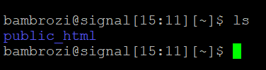

As you can see in the immage above the command *ls* was typed after the
signal <b>\$</b>, before this signal you have your user name, so any
command shoulbe be typed after this signal.

After type *ls* and hit the “enter” button in your keyboard, the
terminal will show you the content of that directory, in this example
just the directory *public_html*.

<div style="border-bottom: 1px solid #ccc;">

</div>

<br>

<span style="font-weight:bold;">(b)</span> The
<span style="color: blue;">cd command </span> stands for *change
directory* and will enable you go to another directory

``` bash
cd public_html 
```

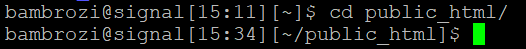

This command is equivalent to hit any directory on WinSCP.

Note that now after the user name we can see the current directory, in
this case *public_html*. If we type again *ls* we will see the content
of *public_html* directory.

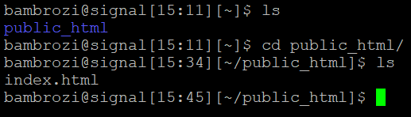

We can observe that the file *index.html* is the content of this
directory. Note that directories as *public_html* are shown in
<span style="color:blue;&quot;">blue</span> and files as *index.html*
are show in white.

<div style="border-bottom: 1px solid #ccc;">

</div>

<br>

<span style="font-weight:bold;">(c)</span> The
<span style="color: blue;">cd .. command </span> will bring you back to
the parent directory

``` bash
cd ..
```


So as you can see in the image above, the command *cd ..* took you back
to the same directory you was before you use the *cd public_html*
command. The red arrows in the image below show the equivalent buttons
to this command line in the WinSCP version.

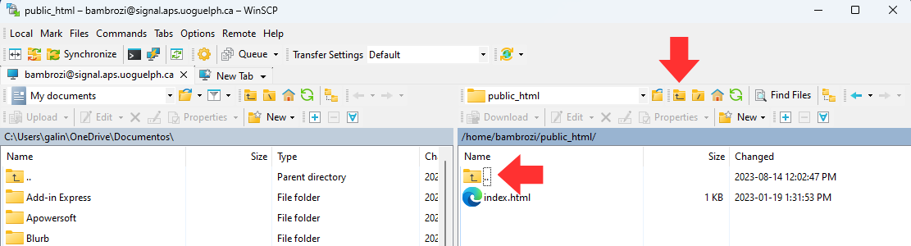

<br>

<div style="border-bottom: 1px solid #ccc;">

</div>

<br>

<span style="font-weight:bold;">(d)</span> The
<span style="color: blue;">cd / command </span> will bring you to the
root directory

``` bash
cd / 
```

<div style="border-bottom: 1px solid #ccc;">

</div>

<br>

<span style="font-weight:bold;">(e)</span> The
<span style="color: blue;">pwd command </span> stands for Print Working
Directory. Displays the current working directory’s full path.

``` bash
pwd 
```

<div style="border-bottom: 1px solid #ccc;">

</div>

<br>

<span style="font-weight:bold;">(f)</span> The
<span style="color: blue;">mkdir command </span> stands for Make
Directory. Creates a new directory.

``` bash
mkdir 'new_directory' 
```

On WinSCP you can use the button *new*
(<span style="color:green;&quot;">green arrow</span>) and then the
*directory* button (<span style="color:blue;&quot;">blue arrow</span>)
to create a new directory.

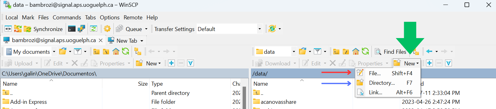

<br>

<div style="border-bottom: 1px solid #ccc;">

</div>

<br>

<span style="font-weight:bold;">(g)</span> The
<span style="color: blue;">rm command </span> stands for Remove. Deletes
files or directories

``` bash
rm filename 
```

or

``` bash
rm -r directory
```

On WinSCP you can use the button *X* (<span style="color:red;&quot;">red
arrow</span>) to delete the selected file or directory.

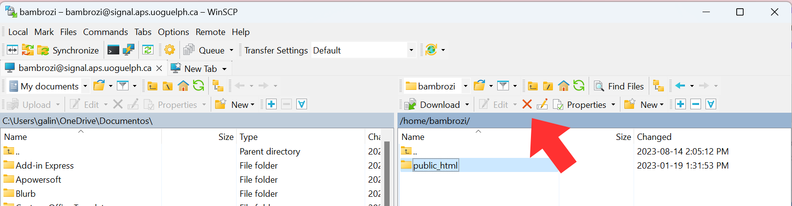

<br>

<div style="border-bottom: 1px solid #ccc;">

</div>

<br>

<span style="font-weight:bold;">(h)</span> The
<span style="color: blue;">cp command </span> Stands for copy. Copies
files or directories from one location to another.

``` bash
cp source_file destination
```

On WinSCP Hitting the right button while your cursor is over one
directory or file will make a menu pop up. In this menu you can use the
copy function (<span style="color:red;&quot;">red arrow</span>).

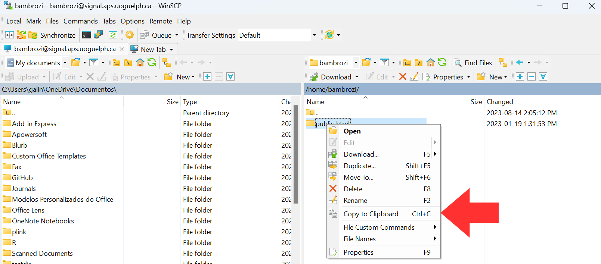

<br>

<div style="border-bottom: 1px solid #ccc;">

</div>

<br>

<span style="font-weight:bold;">(i)</span> The
<span style="color: blue;">mv command </span> stands for Move. Moves
files or directories from one location to another (can also be used for
renaming).

``` bash
mv old_name new_name
```

or

``` bash
mv source destination
```

Also hitting the right button while your cursor is over one directory or
file will make a menu pop up. In this menu you can use the move function
(<span style="color:red;&quot;">red arrow</span>).

Another function that can be find in this menu is the option *rename*
(<span style="color:blue;&quot;">blue arrow</span>).

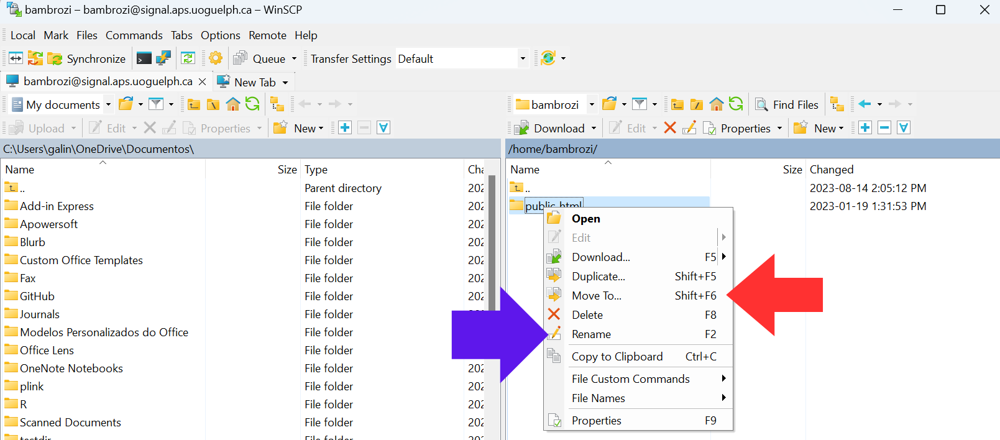

<br>

<div style="border-bottom: 1px solid #ccc;">

</div>

<br>

<span style="font-weight:bold;">(j)</span> The
<span style="color: blue;">touch command </span> Creates an empty file.

``` bash
touch filename
```

Alternatively, on WinSCP you can use the button *new*
(<span style="color:green;&quot;">green arrow</span>) and then the
*file* button (<span style="color:red;&quot;">red arrow</span>) to
create a new directory.


<br>

<div style="border-bottom: 1px solid #ccc;">

</div>

<br>

<span style="font-weight:bold;">(k)</span> The
<span style="color: blue;">cat command </span> stands for Concatenate.
Displays the contents of a file.

``` bash
cat filename
```

<div style="border-bottom: 1px solid #ccc;">

</div>

<br>

<span style="font-weight:bold;">(l)</span> The
<span style="color: blue;">grep command </span> stands for Global
Regular Expression Print. Searches for a specific pattern in files.

``` bash
grep "pattern" filename
```

<div style="border-bottom: 1px solid #ccc;">

</div>

<br>

<span style="font-weight:bold;">(m)</span> The
<span style="color: blue;">chmod command </span> stands for Change Mode.
Changes the permissions of files or directories.

``` bash
chmod permissions filename
```

On WinSCP you can use the button *properties*
(<span style="color:green;&quot;">green arrow</span>) and then the
*Permissions* area (<span style="color:red;&quot;">red rectangle</span>)
to change the permissions of your file or directory.

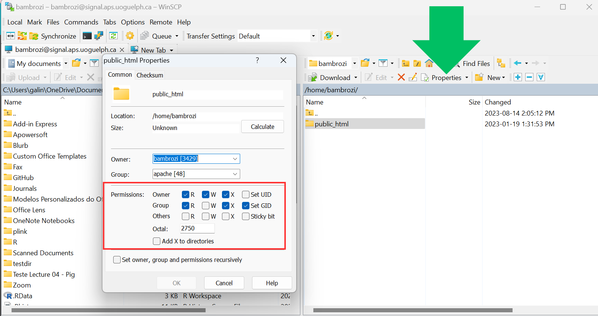

<br>

<div style="border-bottom: 1px solid #ccc;">

</div>

<br>

<span style="font-weight:bold;">(n)</span> The
<span style="color: blue;">ps command </span> stands for Process Status.
Displays information about running processes.

``` bash
ps aux
```

<div style="border-bottom: 1px solid #ccc;">

</div>

<br>

<span style="font-weight:bold;">(o)</span> The
<span style="color: blue;">top command </span> Displays real-time system
information and running processes

``` bash
top
```

<div style="border-bottom: 1px solid #ccc;">

</div>

<br>

<span style="font-weight:bold;">(p)</span> The
<span style="color: blue;">kill command </span> Sends a signal to a
process, often used to terminate a process.

``` bash
kill process_id
```

<div style="border-bottom: 1px solid #ccc;">

</div>

<br>

<span style="font-weight:bold;">(q)</span> The
<span style="color: blue;">man command </span> stands for Manual.
Displays the manual page for a command.

``` bash
man command_name
```

<div style="border-bottom: 1px solid #ccc;">

</div>

<br>

<span style="font-weight:bold;">(r)</span> The
<span style="color: blue;">df command </span> stands for Disk Free.
Shows the amount of disk space used and available on file systems.

``` bash
df -h
```

<div style="border-bottom: 1px solid #ccc;">

</div>

<br>

<span style="font-weight:bold;">(r)</span> The
<span style="color: blue;">du command </span> stands for Disk Usage.
Shows the disk space used by files and directories.

``` bash
du -h
```

<div style="border-bottom: 1px solid #ccc;">

</div>

<br>
